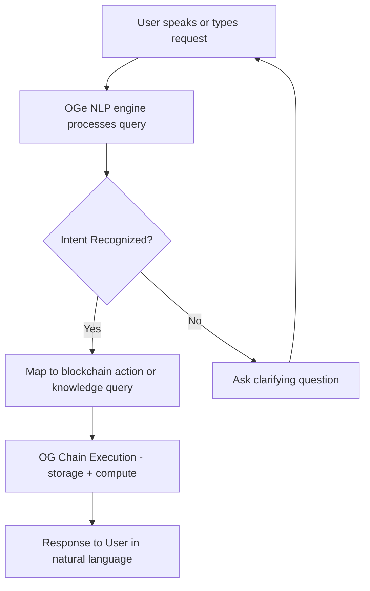

# 🌟 OGe – Your AI-Powered Web3 Companion

> **Tagline:** “Talk to your wallet. Talk to your chain. Talk to your world.”

---

## 🎯 The Vision

Web3 today is powerful, but overwhelming. New users struggle with onboarding, wallets, gas fees, and dApps.
**OGe** is a **personal AI-powered companion** that bridges this gap, helping anyone navigate decentralized ecosystems seamlessly. Unlike centralized assistants (Siri, Alexa, Google Assistant), OGe is:

* User-owned: Data never leaves the user’s control.
* Decentralized: Powered by OG’s compute and storage.
* Composable: Can be integrated into dApps, wallets, and enterprise solutions.

Our goal is to redefine digital assistance — privacy-first, transparent, and unstoppable.

Imagine:

* Asking *“Send 5 USDC to Alex”* and OGe executes it.
* Saying *“Explain this NFT project in simple words”* and OGe teaches you.
* Requesting *“Summarize my last 5 transactions”* and OGe responds instantly.

**OGe is not just a chatbot. It’s your AI-native, wallet-aware, and gasless Web3 guide.**

---

## 💡 Why OGe?

* **Onboarding**: New users get confused. OGe turns questions into actions.
* **Accessibility**: Voice + text support for diverse communities.
* **Simplicity**: Removes friction of managing keys, gas, or jargon.
* **Trust**: Uses OG’s compute + storage so all interactions are on-chain verifiable.

---

## 🛠️ How It Works

### 🗣️ User Flow

---

### 🧩 Core Components

* **Conversational AI Layer**
  Natural language processing & intent detection.

* **Wallet Integration**
  Users authenticate with OG accounts (no keys to manage).

* **Gasless Transactions**
  Powered by OG prefunding & paymaster-like infra.

* **Knowledge Assistant**
  Summarizes transactions, explains protocols, and acts as tutor.

* **Compute + Storage**
  Powered entirely on OG, ensuring trustless execution.

---

## 🚀 Use Cases

* **Newbie Mode**: Onboards first-time users with step-by-step guidance.
* **Pro Mode**: Shortcuts for quick DeFi actions.
* **Educator**: Explains crypto concepts in local languages.
* **Community Tool**: Group chats with OGe in DAOs for real-time queries.

---

## 🎨 Differentiators

1. **Personality & Branding**: Not a dry bot — OGe feels like a friendly companion.
2. **Voice + Multilingual Support**: Accessibility baked-in from day one.
3. **Explain + Execute**: Other bots only talk. OGe talks *and acts*.
4. **OG-Native**: Full OG storage + compute + prefunding advantage.

---

## 🛤️ Roadmap (Ideation → MVP → Scale)

### Wave 1 (Now – Ideation)

* Define flows, personas, and architecture.
* Build mockups + flowcharts for clarity.

### Wave 2 (MVP)

* Basic chatbot with intent → action mapping.
* Connect to OG storage + prefunded transactions.
* Wallet onboarding + 2-3 demo actions.

### Wave 3 (Scale)

* Voice integration.
* Multilingual knowledge assistant.
* DAO + group assistant support.
* Plugin marketplace for dApps.

---

## 🌍 Impact

* **For Users**: Makes Web3 accessible like WhatsApp, not Excel.
* **For OG Ecosystem**: Showcases OG as the *home for AI + Web3 fusion*.
* **For Hackathon Judges**: Demonstrates both creativity and technical depth.

---

## 🎥 Next Step for Demo

* Animated flowchart of “User → OGe → Blockchain → Response.”
* Mock conversation screenshots (“Send \$5 to friend” → executed).

---

⚡ **OGe isn’t just an AI chatbot. It’s the gateway for the next billion users into decentralized ecosystems.**

