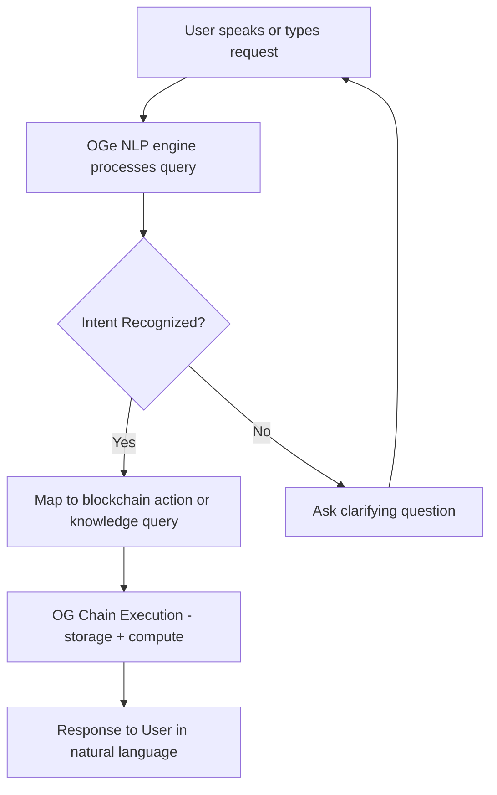

# OGe – Your AI-Powered Web3 Companion

> **Tagline:** “Talk to your wallet. Talk to your chain. Talk to your world.”

---

## The Vision

Web3 today is powerful, but overwhelming. New users struggle with onboarding, wallets, gas fees, and dApps.
**OGe** is a **personal AI-powered companion** that bridges this gap, helping anyone navigate decentralized ecosystems seamlessly. Unlike centralized assistants (Siri, Alexa, Google Assistant), OGe is:

* User-owned: Data never leaves the user’s control.
* Decentralized: Powered by OG’s compute and storage.
* Composable: Can be integrated into dApps, wallets, and enterprise solutions.

Our goal is to redefine digital assistance — privacy-first, transparent, and unstoppable.

Imagine:

* Asking *“Send 5 USDC to Alex”* and OGe executes it.
* Saying *“Explain this NFT project in simple words”* and OGe teaches you.
* Requesting *“Summarize my last 5 transactions”* and OGe responds instantly.

**OGe is not just a chatbot. It’s your AI-native, wallet-aware, and gasless Web3 guide.**

---

## Why OGe?

* **Onboarding**: New users get confused. OGe turns questions into actions.
* **Accessibility**: Voice + text support for diverse communities.
* **Simplicity**: Removes the friction of managing keys, gas, or jargon.
* **Trust**: Uses OG’s compute + storage so all interactions are on-chain verifiable.

## Key Features

* **Voice & Chat Support**: Conversational AI powered by OG compute.
* **Personalized Memory**: User-specific memory stored privately on OG Storage.
* **Cross-dApp Assistance**: Integrates with multiple OG-powered apps.
* **Gasless UX**: Leveraging OG’s prefunded relayers for smooth onboarding.
* **Verifiable Responses**: AI responses can be cryptographically verified.

---

## 🛠️ How It Works

### 🗣️ User Flow

---

### Core Components

* **Conversational AI Layer**
  Natural language processing & intent detection.

* **Wallet Integration**
  Users authenticate with OG accounts (no keys to manage).

* **Gasless Transactions**
  Powered by OG prefunding & paymaster-like infra.

* **Knowledge Assistant**
  Summarizes transactions, explains protocols, and acts as a tutor.

* **Compute + Storage**
  Powered entirely on OG, ensuring trustless execution.

---

## Use Cases

* **Newbie Mode**: Onboards first-time users with step-by-step guidance.
* **Pro Mode**: Shortcuts for quick DeFi actions.
* **Educator**: Explains crypto concepts in local languages.
* **Community Tool**: Group chats with OGe in DAOs for real-time queries.

---

## Differentiators

1. **Personality & Branding**: Not a dry bot — OGe feels like a friendly companion.
2. **Voice + Multilingual Support**: Accessibility baked-in from day one.
3. **Explain + Execute**: Other bots only talk. OGe talks *and acts*.
4. **OG-Native**: Full OG storage + compute + prefunding advantage.

---

## Future Extensions

**Multi-Agent Ecosystem**: Domain-specific assistants (finance, education, health).
**Plugin System**: Developers can build and publish extensions.
**DAO Governance**: Community-driven improvements and model updates.

## Impact

* **For Users**: Makes Web3 accessible like WhatsApp, not Excel.
* **For OG Ecosystem**: Showcases OG as the *home for AI + Web3 fusion*.

---

## Why OG + AI is Unstoppable
**Decentralization**: Removes single points of failure.
**User Empowerment**: Data belongs to the user, not corporations.
**Future-Proof**: AI meets Web3 — the next evolution of digital assistants.

## User Stories

1. **Student on OG**

   * *As a student*, I want to ask the OG Assistant to summarize my class notes quickly so I can revise efficiently before exams.
   * *As a student*, I want the assistant to remind me of deadlines and automatically draft a study plan, so I don’t fall behind.

2. **Startup Founder on OG**

   * *As a founder*, I want to use OG Assistant to draft investor pitches from my OG storage files, so I can move faster without context switching.
   * *As a founder*, I want to query financial models in natural language, so I can get instant insights without hiring a data analyst.

3. **Everyday User on OG**

   * *As a user*, I want to chat with OG Assistant in a conversational tone, so I feel like I’m talking to a personal AI companion.
   * *As a user*, I want the assistant to run small automations (e.g., summarize meetings, generate emails, or search OG compute) so I save time daily.

---

⚡ **OGe isn’t just an AI chatbot. It’s the gateway for the next billion users into decentralized ecosystems.**

